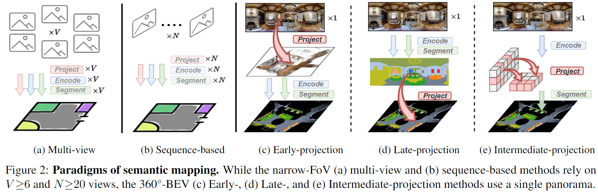
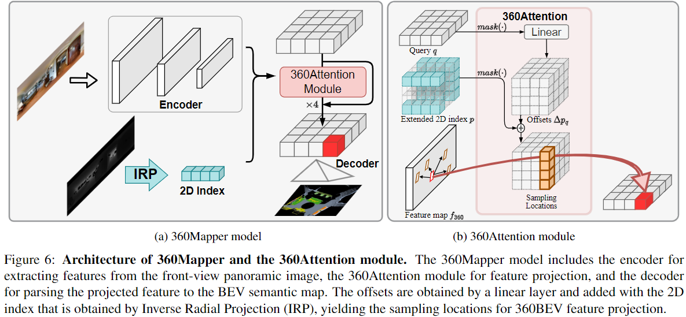

<div align="center"> 

### 360BEV: Panoramic Semantic Mapping for Indoor Bird’s-Eye View (IEEE/CVF WACV 2024)

</div>

<p align="center">
<a href="https://arxiv.org/pdf/2303.11910.pdf">
    </a>
<a href="https://jamycheung.github.io/360BEV.html">
    </a>
<a href="https://pytorch.org/">
    </a>
<a href="https://github.com/jamycheung/DELIVER/blob/main/LICENSE">
    </a>
</p>

<br />




## Introduction

In this work, mapping from 360° panoramas to BEV semantics, the **360BEV** task, is established for the first time to achieve holistic representations of indoor scenes in a top-down view. Instead of relying on narrow-FoV image sequences, a panoramic image with depth information is sufficient to generate a holistic BEV semantic map. To benchmark 360BEV, we present two indoor datasets, 360BEV-Matterport and 360BEV-Stanford, both of which include egocentric panoramic images and semantic segmentation labels, as well as allocentric semantic maps.

For more details, please check our paper.

## :fire: Update
- [x] 02/2025, update 360BEV datasets and dataloader code.
- [x] 05/2023, release datasets.
- [x] 04/2023, release code and models.
- [x] 03/2023, init repository.

## 360BEV datasets

Prepare datasets:
- [Stanford2D3D](https://arxiv.org/abs/1702.01105)
- [Matterport3D](https://niessner.github.io/Matterport)

Our extended datasets:
- 360BEV-Stanford **(New name: Stanford-360)** (**Download from [Google Drive](https://drive.google.com/file/d/1XzhYkJL_5pbT7I4YNiVYGRN-1ay3MsUW/view?usp=sharing)**)
- 360BEV-Matterport **(New name: Matterport-360)** (**Download from [Google Drive](https://drive.google.com/file/d/1GoskbMx_tZ9kuk39jVeKrOgndMXBz-HP/view?usp=sharing)**)
- 360FV-Matterport (**Download from [Google Drive](https://drive.google.com/file/d/1RD0sfINWJmGetremLu0ZO7ZvoSYRZVeJ/view?usp=sharing)**)

Data statistics of 360BEV datasets:

| Dataset  | Scene  | Room | Frame | Category |
|-------------------|:----------------:|:---------------:|:----------------:|:-------------------:|
| train    |         5        |       215       |       1,040      |          13         |
| val      |         1        |        55       |        373       |          13         |
| **360BEV-Stanford**   |         6        |       270       |       1,413      |          13         |
| train    |        61        |        --       |       7,829      |          20         |
| val      |         7        |        --       |        772       |          20         |
| test     |        18        |        --       |       2,014      |          20         |
| **360BEV-Matterport** |        86        |      2,030      |      10,615      |          20         |

Dataset structure:
```text
data/
├── Stanford2D3D
│   └── area_[1|2|3|4|5a|5b|6]
│       ├── rgb/*png
│       └── semantic/*png
│
├── 360BEV-Stanford
│   ├── bev
│       └── *.h5 
│   ├── train
│       └── *.png 
│   └── val
│       └── *.png
│
├── 360BEV-Matterport
│   ├── bev
│       └── *.h5 
│   ├── train
│       └── *.png 
│   └── val
│       └── *.png
│   └── test
│       └── *.png
│
└── 360FV-Matterport
    ├── 17DRP5sb8fy
    │   ├── depth/*.png
    │   ├── rgb/*.png
    │   └── semantic/*.png   
    └── ...

```


## 360Mapper model



## Results and weights

### 360FV Stanford-2D3D 

| Model      | Backbone   | Input | mIoU  | weights |
| :--------- | :--------- | :---- | :---- | :------ |
| Trans4PASS | MiT-B2     | RGB   | 52.1 |         |
| CBFC       | ResNet-101 | RGB   | 52.2 |         |
| Ours       | MiT-B2     | RGB   | **54.3** | [B2](https://drive.google.com/drive/folders/1hPmZaWeojfNVQ3NUI4P1CZafK1X1LRwW?usp=share_link) |

### 360FV-Matterport

| Model      | Backbone   | Input | mIoU  | weights |
| :--------- | :--------- | :---- | :---- | :------ |
|HoHoNet |  ResNet-101 | RGB-D | 44.85 | |
|SegFormer  |  MiT-B2 | RGB | 45.53 | |
|Ours |  MiT-B2 | RGB | **46.35** | [B2](https://drive.google.com/drive/folders/14myQElCSWEsI8VvYYWAD_1U412jIqiAa?usp=share_link) |


### 360BEV-Stanford
| Method    | Backbone | Acc    | mRecall | mPrecision | mIoU        | weights |
| :--------- | :----------: | :--------: | :---------: | :------------: | :------------: | :-------------- |
|Trans4Map | MiT-B0 | 86.41 | 40.45 | 57.47 | 32.26 |  |
|Trans4Map | MiT-B2 | 86.53 | 45.28 | 62.61 | 36.08 |  |
| Ours | MiT-B0       | 92.07     | 50.14      | 65.37         | 42.42          |  [B0](https://drive.google.com/file/d/1FbUciae3B_xXowtxN6RP7L6NLkIrvXWe/view?usp=share_link) |
| Ours | MiT-B2       | **92.80** | 53.56      | 67.72         | 45.78          |  [B2](https://drive.google.com/file/d/11PLufI8J3NioD53i0NK3V9oRmZSYbsZO/view?usp=share_link) |
| Ours | MSCA-B       | 92.67     | **55.02**  | **68.02**     | **46.44**      |  [MSCA-B](https://drive.google.com/file/d/1luGX1s4_rjIvugYDP0U1aspb3tNCjBXN/view?usp=share_link) |

### 360BEV-Matterport
| Method    | Backbone | Acc    | mRecall | mPrecision | mIoU        | weights |
| :--------- | :----------: | :--------: | :---------: | :------------: | :------------: | :-------------- |
|Trans4Map | MiT-B0 | 70.19 | 44.31 | 50.39 | 31.92  |  |
|Trans4Map | MiT-B2 | 73.28 | 51.60 | 53.02 | 36.72  |  |
| Ours | MiT-B0 | 75.44 | 48.80 | 56.01 | 36.98  | [B0](https://drive.google.com/file/d/1B3wtAbb57P56QQIX6tAUNwoRp07Y7zIV/view?usp=share_link) |
| Ours | MiT-B2 | 78.80 | 59.54 | 59.97 | 44.32  | [B2](https://drive.google.com/file/d/1B1zxgYn5w_VRb1oZ8h4b6Zm0BgQsxlgs/view?usp=share_link) |
| Ours | MSCA-B |**78.93** | **60.51** | **62.83** | **46.31** | [MSCA-B](https://drive.google.com/file/d/1MoBzRX-GmVEvMlthmvl-n5v2hIe6lOgd/view?usp=share_link) |

### Installation
```bash
#### To create conda env:
    conda create -n 360BEV python=3.8
    conda activate 360BEV
    cd /path/to/360BEV
    pip install -r requirements.txt
```
 To make the model run successful, we need to install [mmdetection](https://mmdetection.readthedocs.io/en/v2.0.0/install.html).


## Train
For example, use 4 2080Ti GPUs to run the experiments:
```bash

# 360BEV_Matterport
python train_360BEV_Matterport.py --config configs/model_360BEV_mp3d.yml

# 360BEV_S2d3d
python train_360BEV_S2d3d.py --config configs/model_360BEV_s2d3d.yml

# Stanford2D3D
python train_pano_360Attention_S2d3d.py --config configs/model_fv_s2d3d.yml

# 360FV-Matterport
python train_pano_360Attention_Matterport.py --config configs/model_fv_mp3d.yml

```

## Test

```bash
# 360BEV_Matterport
python test_360BEV_Matterport.py --config configs/model_360BEV_mp3d.yml

# 360BEV_S2d3d
python test_360BEV_S2d3d.py --config configs/model_360BEV_s2d3d.yml

# Stanford2D3D
python test_pano_360Attention_S2d3d.py --config configs/model_fv_s2d3d.yml

# 360FV-Matterport
python test_pano_360Attention_Matterport.py --config configs/model_fv_mp3d.yml

```


## References
We appreciate the previous open-source works.
* [BEVFormer](https://github.com/fundamentalvision/BEVFormer)
* [SegFormer](https://github.com/NVlabs/SegFormer)
* [SegNeXt](https://github.com/visual-attention-network/segnext)
* [mmsegmentation](https://github.com/open-mmlab/mmsegmentation)

## License

This repository is under the Apache-2.0 license. For commercial use, please contact with the authors.


## Citation

If you are interested in this work, please cite the following work:
```
@inproceedings{teng2024_360bev,
  title={360BEV: Panoramic Semantic Mapping for Indoor Bird's-Eye View}, 
  author={Teng, Zhifeng and Zhang, Jiaming and Yang, Kailun and Peng, Kunyu and Shi, Hao and Reiß, Simon and Cao, Ke and Stiefelhagen, Rainer},
  booktitle={2024 IEEE/CVF Winter Conference on Applications of Computer Vision (WACV)},
  year={2024}
}
```
